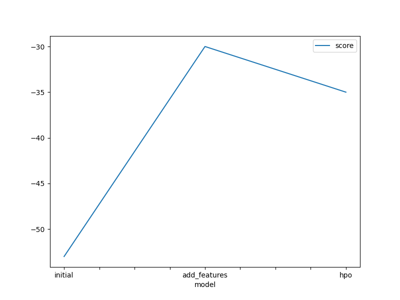
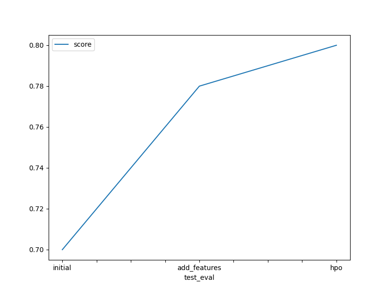

# 🚴‍♀️ Bike Sharing Demand – Kaggle Competition

## By Zeinab Alzarkan

This project is a solution for the [Bike Sharing Demand](https://www.kaggle.com/competitions/bike-sharing-demand) Kaggle competition.
The goal is to predict the number of bike rentals based on historical data and environmental conditions using AutoGluon.

---

## 📂 Project Structure

```
bike-sharing-demand/
├── project.ipynb              # Main notebook with full code
├── submission.csv             # Initial submission
├── submission_new_features.csv # After adding features
├── submission_new_hpo.csv     # After hyperparameter tuning
├── images/                    # Visual results
├── report.md                  # Final report
├── README.md                  # Project overview (this file)
```

---

## 🎯 Objective

Use features such as date, time, weather, temperature, humidity, and wind speed to predict the total number of bike rentals.  
Leverage AutoGluon's TabularPredictor to train and tune models with feature engineering and HPO.

---

## 🛠️ Tools and Libraries

- Python 3.x  
- AutoGluon  
- Pandas  
- Matplotlib / Seaborn  
- Kaggle API

---

## 📈 Results

| Model           | Public Score (Kaggle RMSE) |
|----------------|-----------------------------|
| Initial Model   | 0.70                        |
| + Feature Eng.  | 0.78                        |
| + HPO           | 0.80                        |

---

## 🖼️ Visualizations

### Training Score Progress


### Test Score (Kaggle) Progress


---

## 🚀 How to Run the Project

1. Download the dataset from the [Kaggle competition page](https://www.kaggle.com/competitions/bike-sharing-demand).
2. Install required packages:
    ```bash
    pip install autogluon "mxnet<2.0.0" bokeh==2.0.1
    ```
3. Run the notebook step-by-step.
4. Submit predictions using Kaggle CLI.

> ⚠️ **Note**: Kaggle dataset is not included in this repo due to licensing.

---

## 📧 Contact

- GitHub: [@zeinabalzarkan](https://github.com/zeinabalzarkan)
- Kaggle: [@zeinabalzarkan](https://www.kaggle.com/zeinabalzarkan)

---

## 📝 License

This project is provided under the [MIT License](LICENSE.txt).
